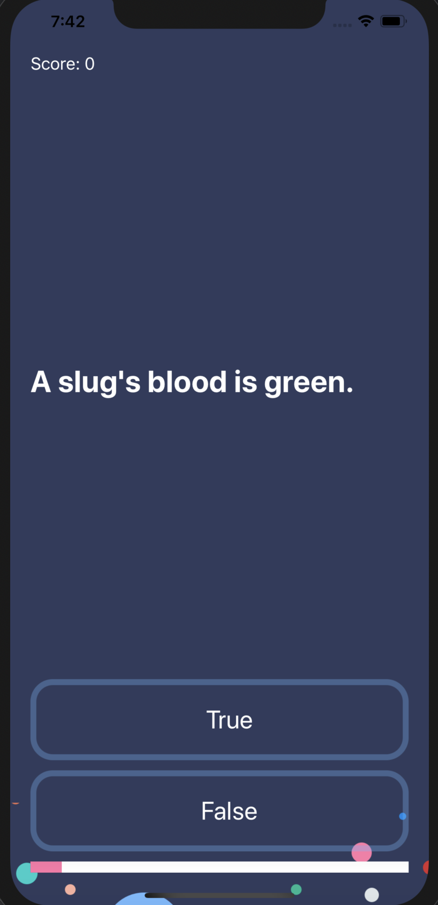

# IOS-Projects

Course 
https://www.udemy.com/course/ios-13-app-development-bootcamp/

### Dice
A Las Vegas dice app that make the die roll at the press of a button. 

### Xylophone
A colorful Xylophone app that plays music when the buttons are pressed. 

### Egg Timer
An egg timer app that tracks how long it takes to boil eggs to soft, medium or hard. 

### Quizzler
A trivia game app. Uses structs and MVC design pattern. 

### BMI Calculator
BMI calculator app that takes weight and height as inputs. Uses MVC design pattern, navigation and segues. 

### Tipsy
Tip calculator app that takes bill amount, tip percentage and number of people to split the bill as input. Calculates the total per person. 

