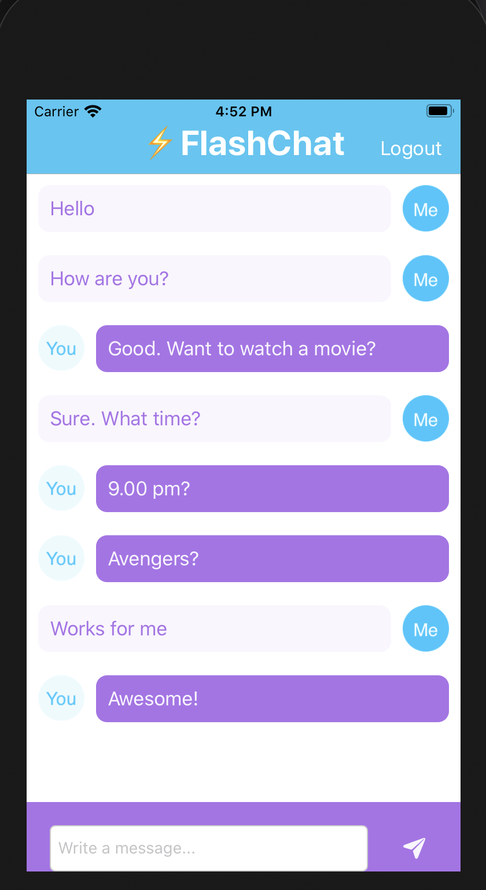

# IOS-Projects

Course 
https://www.udemy.com/course/ios-13-app-development-bootcamp/

### 1. Dice
A Las Vegas dice app that make the die roll at the press of a button. 

### 2. Xylophone
A colorful Xylophone app that plays music when the buttons are pressed. 

### 3. Egg Timer
An egg timer app that tracks how long it takes to boil eggs to soft, medium or hard. 

### 4. Quizzler
A trivia game app. Uses structs and MVC design pattern. 

### 5. BMI Calculator
BMI calculator app that takes weight and height as inputs. Module contains optionals, MVC design pattern, navigation and segues. 

### 6. Tipsy
Tip calculator app that takes bill amount, tip percentage and number of people to split the bill as input. Calculates the total per person. 

### 7. Clima
Weather app that lets you search for a location and shows the temperature at that location. Uses API from OpenWeather Map https://openweathermap.org/. Module contains dark mode, vector images, protocols, delegate design pattern, URLSession for making API calls, Closures, JSON decoding, updating UI using dispatch queue, extensions and using core location to get location data. 

### 8. Flash Chat
Lets people chat with each other. Uses Firebase Firestore to store messages. Uses cocoapods, authentication using Firebase, tableviews.  

### 9. Todoey
A todolist app to keep track of all your tasks. Uses table view, alert view container, swipable cells, filtering search results, encoding and decoding using NSCoder. The module focussed on local data persistance using user defaults, custom plist, core data and Realm. Final app uses Realm. 

